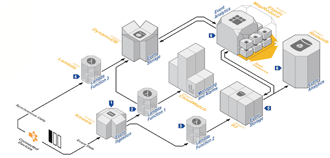

# 从小程序•云开发谈谈Serverless架构在互联网公司的落地设计

自从K8S之后，各类*aaS的架构设计层出不穷，相信后端的小伙伴已经对各种架构耳熟能详，但是如果说有一个应用，真正让“Serverless（无服务架构）”得到大范围落地，那就是“小程序•云开发”（以下简称小程序），和其他Serverless架构相比，小程序的以下特性让我产生了浓厚的兴趣。

* 对大部分个人类应用，80%以上应用逻辑无需后端编码。
* 依托微信强大的账号生态，“真正实现低成本的软件开发”

本文就以“小程序•云开发”为启发，对“无服务架构”功能和愿景做**补充**和总结，重点介绍，如何综合公司SaaS和FaaS的能力，如何实现低成本的软件迭代。

内容概要：

* FaaS平台的用户认证和授权
* 数据库存储功能
* 文件存储功能
* 云函数（cloud functions）
* 与其他架构模式相结合快速开发应用

例如：小程序•云开发的入口界面，包含了常见的后端服务逻辑。


## 1. Serverless简介

如同许多新的概念一样，Serverless目前还没有一个普遍公认的权威的定义。 最新的一个定义是这样描述的：“无服务器架构是基于互联网的系统，其中应用开发不使用常规的服务进程。 目前看来，无服务器平台**实质**是将公共的的服务器端技术抽象，并开放函数计算接入的伸缩平台。常见的FaaS平台提供了以下基础能力：

1. 用户授权和管理
2. 数据库存取 （JSON数据的Restful抽象封装）
3. 文件存取
4. 消息推送（可选）
5. 云函数（类似：Fission）

可以看到FaaS平台实质是将我们常见的业务，归纳为“用户”，“数据”，“函数”， 将常见“用户数据的增删改查”，进一步抽象和封装。

##  2. 用户认证和管理

纯客户端的网络数据读写，主要依赖于一个完善的账号认证体系，因此账户认证是“无服务平台的基础”， 以下界面是一个Serviceless平台所提供的用户管理界面，包含登录，登录方法配置，和消息模板。


>用户管理，查看当前平台注册的用户数量，主要特性：
>
>1. 支持管理员/用户权限配置
>2. 支持从邮箱，手机，微信，Facebook等平台注册用户（见下图）


>登录方式配置， 支持配置自己的第三方SNS平台key和secret，特点：
>
>1.  支持对每种登录方式进行打开或关闭
>2.  支持注册配额限制。
>3. 支持多种登录账号的融合。


> 消息模板配置。 将账户平台所涉及的通知和验证以模版的形式提供自定义接口， 支持“多语言模板配置”， 支持短信发送提供商配置。

从界面上可以看到，Serviceless至少从用户管理，登录方法和模板配置三个界面对常见的账户服务进行抽象，但是作为Serviceless的基础，账户的逻辑远没有界面上展示的那样简单，这个完整的账号服务，至少包含了以下逻辑：

1. [OAuth Password Credentials ](https://www.oauth.com/oauth2-servers/access-tokens/password-grant/) 用户密码授权逻辑。（包含多客户端，验证码，校验频次限制等）
2. [Implicit Credentials. ](https://oauth.net/2/grant-types/implicit/ )  implicit 授权逻辑。（无需服务器端，可以通过客户端直接获取授权token）
3. 跨域域名配置。账户登录接口作为服务，必须指定可调用域名，否则可能造成请求伪造攻击。
4. 管理员和普通用户配置。 在大多数业务场景下，我们需要管理员去控制统计，数据清理等逻辑。
5. 自定义第三方登录配置。允许用户通过少量的客户端代码，生成自己的第三方登录方法。

> implicit 授权方式是一种前端安全的服务器架构的授权方式，这种授权方式，允许旗下多个子域名共享一套账号体系且共用一个登录界面。

在某些复杂的场景下，我们需要用户服务的Oauth能力来保证用户数据的开放透明，例如：Google用户体系，他可以用于登录Youtube，Blogger，Google cloud的场景。 就目前技术层面而言，OAuth 2.0 是这方面做的最全面的一套标准。

##  3. 数据库存取抽象


> 数据库管理界面，特点
> 1. 支持自动生成 “_user” 字段
> 2. ID为UUID
>


> 数据库权限配置管理界面，特点：
>
> 1. 将常见的增删改查逻辑在数据库配置层进行处理。

可以从小程序•云开放的截图上粗略看到关于无服务程序在数据层的抽象逻辑是：将云端的Restful 增删改查，抽象为任意集合，这些集合的权限则基于： 管理员，创建者，所有用户三者角色进行设计。这些角色的配置如下：

* 所有用户可读，仅创建者及管理员可写

>适用场景：用户评论、用户公开信息等

* 仅创建者及管理员可读写

>适用场景：用户个人设置、用户订单管理等

* 所有用户可读，仅管理员可写

>适用场景：商品信息等

* 仅管理员可读写

>适用场景：后台流水数据等

### 安全相关补充逻辑

当然，我们现实的使用场景中，几乎无可避免地进行关联查询和关联删除，因此，这部分逻辑抽象，可以通过上图中的索引完成，一个完成的无服务数据库逻辑如下：（大部分内容为博主脑补添加，小程序并未实现）

1. 自动添加 “_user” 字段，标记用于标记用户权限控制。
2. 允许创建外键删除逻辑。（例如：删除博客时，同时删除对应的评论和文件）
3. 设置集合最大大小。例如：单个集合最大1kb，则用于防止客户端恶意攻击。
4. 设置用户写入频次限制。例如：blog设置为“100条/天/用户”， 则表示：一个用户每天最多可以编写100条博客。


> 总结：从这些信息可以看出纯粹的客户端读写数据库是在更粗粒度对数据权限进行控制，例如：只限制单个collection大小，并不会像常见的后端服务对每个字段进行规则描述。 这样的做的好处是，将用户数据过滤放到前端，适当的后端配置，可以使得钱后端开发难度达到平衡。

## 4. 文件存取


从界面可以看到，文件存取的逻辑和数据操作逻辑类型，在这里不多做描述，在我们实际使用中，我们需要注意以下两点：

1. 除了常见的权限管理外，还需要结合数据库存取的外键配置，防止垃圾数据的产生，例如，在当删除commit的集合时，则删除当前数据库文件操作，可以采用关联外键，或在程序中插入以下代码：

```javascript
//删除评论时，同时删除所关联的文件。
db.commit.onRemove = function() {
      //删除一条关联数据
     files.RemoveID(this.data.file_id)
     //删除多条关联数据
     files.RemoveIDs(this.data.file_ids)
}
```

2. 文件进行CDN绑定，避免主站带宽被占满的情况。

### 安全相关补充逻辑

1. 允许为应用设置多个bucket
2. 配置一个用户1小时内，最多可新增多少条数据
3. 配置独立bucket 单个文件大小

## 5. 云函数


微信相比与其他Serverless平台的优势在于，依托于完善的微信鉴权体系，在大多数个人数据场景下，你无需创建自己的任何后端，但是不可避免一些复杂跨用户的业务或一些非数据类型的业务需要云端逻辑才能完成，因此这里简单下介绍下云函数的概念。 

云函数是FaaS平台的基础，是将我们后端常见的额服务化思维，抽象到一个个具体的函数，然后由网关配置完成相关权限，频次控制，自动伸缩等内容。 例如：微信一个简单的云函数为：

```javascript
// 云函数入口函数
exports.main = (event, context) => {
  var user =  event.userInfo.openId;  
  console.log(event)
  console.log(context)
  return {
    sum: event.a + event.b
  }
}
```

例如：以亚马逊的Lambad为例，云函数逻辑大致为：


后端的的业务通过Event Source 进行驱动，在架构设计时，我们会尽量减少“服务”在业务中的比重。那么“服务”应该出现在什么地方呢？ 请看我下一章补充。

> 更多参考开源FaaS平台，https://**fission**.io


## 6. 架构补充

在普通的互联网应用中，FaaS的实质是将公用的功能模块进行抽象，让技术部门的精力集中在技术本身，例如：今日头条业务，主要职责将集中在推荐算法，迅雷下载，将主要集中在p2p技术的改进和优化，直播业务，主要业务集中在内容分发等。

在实际生产过程中，不存在单一的结构可以完美适配所有问题，因此给出以下开发建议：

### 开发建议：

1. 对于简单的业务，例如：账本，笔记，订单等这类业务完全可以做到0服务器的形式进行开发，如果合理设置数据索引，甚至可以无需自行开发任何fuction。这类业务的特点是，用户只对自己的数据库负责，用户无法影响其他用户数据。
2. 对于支付，直播打赏这类安全性比较高的业务，可以通过传统FaaS开发模式，快速完整第三方平台的对接。
3. 对于：业务消息推送，短信发送可通过SaaS的单体架构形式开发。然后将服务能力按照用户权限逻辑注册到现有Serverless平台的基础组件。
4. 对于复杂的业务，不建议使用Function架构进行开发，因为架构设计，函数之间通讯等问题，传统的微服务架构更加成熟。


> 写在后面：本文旨在探索Serverless落地方案，与小程序•云开发的功能已经有很大的不同。文章内容会结合各种Serverless平台特性和实际开发中遇到的问题做说明，部分截图已经过二次修改，仅供参考。


## 附: Serverless的架构范式参考





