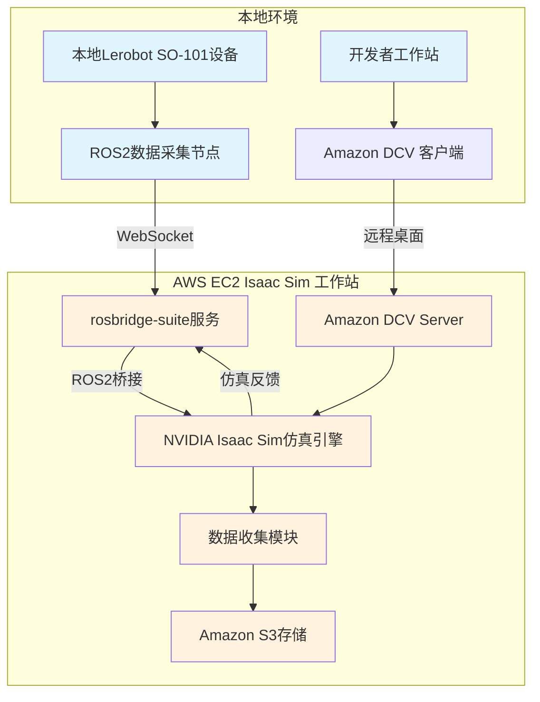
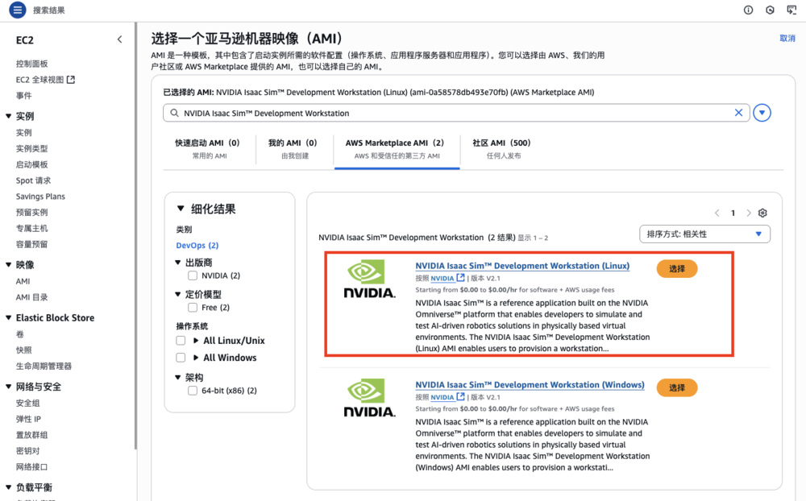
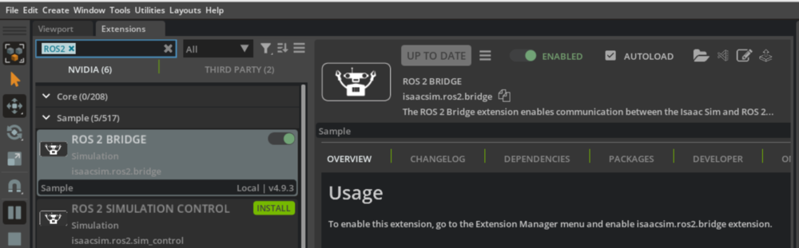
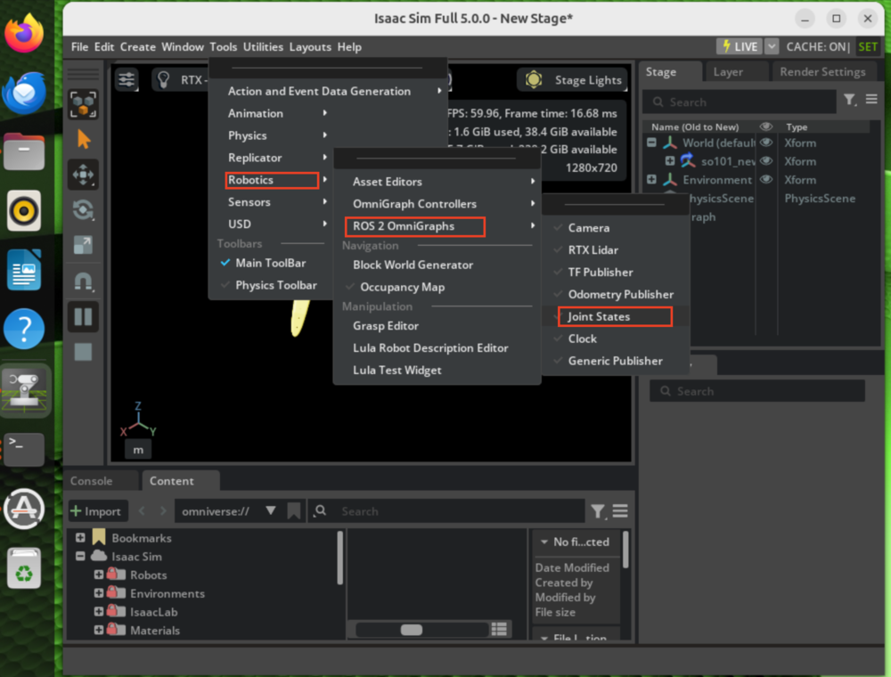
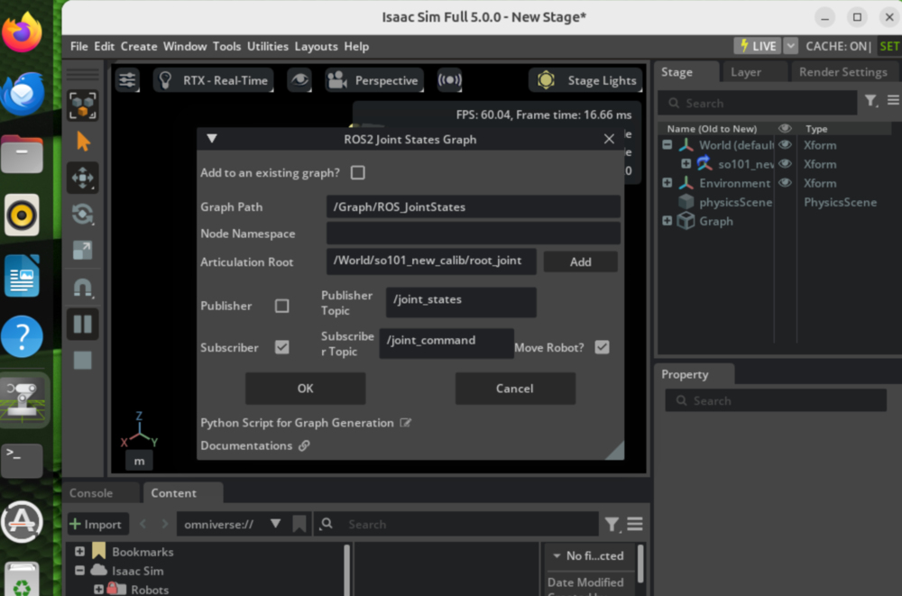
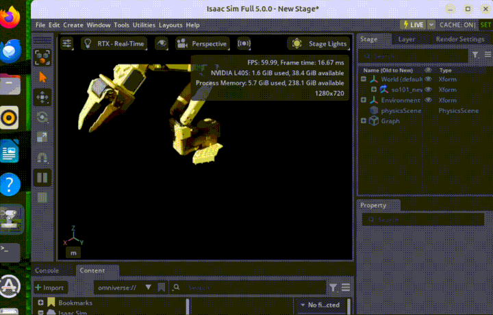

# 云端机器人研发：基于 AWS 实现 ROS 2 设备与 Isaac Sim 的 Lerobot 仿真及数据流

## 背景

在现代机器人开发领域，传统的开发模式往往依赖于真实硬件设备进行数据采集和算法验证，这种方式不仅成本高昂，而且存在设备损坏风险、环境限制等诸多挑战。随着云计算技术的快速发展，基于云端的机器人仿真平台为开发者提供了全新的解决方案。

本文将详细介绍如何利用AWS云计算平台的强大计算能力，结合NVIDIA Isaac Sim仿真环境，实现Lerobot SO-101机械臂的远程遥操作和数据收集。这种云端仿真方案不仅能够显著降低硬件成本，还能提供可扩展的计算资源，支持大规模并行仿真实验，为机器人算法的快速迭代和验证提供理想的开发环境。

## 架构设计

### 流程图



### 架构概述

该架构通过AWS EC2构建云端Isaac Sim仿真环境，实现本地机器人设备与云端仿真的无缝集成，支持远程开发和数据收集。

#### 核心组件

本地环境
• Lerobot SO-101设备作为物理机器人平台
• ROS2数据采集节点负责传感器数据收集
• 开发者工作站提供开发界面
• Amazon DCV客户端实现远程可视化访问

AWS云端环境
• EC2实例运行NVIDIA Isaac Sim仿真引擎
• Amazon DCV Server提供高性能远程桌面服务
• rosbridge-suite实现ROS2与本地设备的通信
• S3存储服务保存仿真数据和模型

#### 数据流程

实时数据同步
1. 本地SO-101设备通过ROS2节点采集传感器数据
2. 数据经WebSocket协议传输至云端rosbridge服务
3. rosbridge将数据桥接到Isaac Sim仿真环境
4. 仿真引擎处理后返回反馈数据到本地设备

远程开发访问
1. 开发者通过DCV客户端连接云端工作站
2. 获得Isaac Sim的完整图形界面访问权限
3. 实时调试和配置仿真参数

数据持久化
1. 仿真过程中的训练数据、模型参数自动收集
2. 通过数据收集模块统一管理
3. 存储至S3实现数据收集

### 实施方案

#### 阶段一：AWS云端基础设施部署

##### 1.1 NVIDIA Isaac Sim™开发工作站部署

访问AWS Marketplace：https://aws.amazon.com/marketplace/pp/prodview-bl35herdyozhw

部署路径：AWS控制台 → EC2 → 启动实例 → 浏览其他AMI → AWS Marketplace AMI → 搜索"NVIDIA Isaac Sim"

选择"NVIDIA Isaac Sim™ Development Workstation (Linux)"，配置网络安全组后启动实例。



**推荐配置规格**：

- 实例类型：`g6e.8xlarge`（GPU加速计算优化）
- 存储容量：`500GB EBS gp3`
- 安全组规则：开放端口22（SSH）、8443（DCV远程桌面）、9090（WebSocket通信）

#### 阶段二：ROS2数据采集环境配置与Rosbridge服务部署

##### 2.1 本地开发环境初始化

```bash
# 创建Lerobot专用Python环境
conda create -y -n lerobot python=3.11
conda activate lerobot
conda install ffmpeg -c conda-forge
pip install 'lerobot[all]'

# 配置ROS2 Jazzy发行版
conda config --add channels conda-forge
conda config --add channels robostack-jazzy
conda config --set channel_priority strict
conda install ros-jazzy-desktop -c robostack-jazzy
```

##### 2.2 AWS实例Rosbridge服务配置

```bash
# 建立SSH安全连接
ssh -i your-key.pem ubuntu@<ec2_instance_ip>

# 配置DCV远程访问凭据
sudo passwd ubuntu

# 部署ROS2 Jazzy发行版
sudo curl -sSL https://raw.githubusercontent.com/ros/rosdistro/master/ros.key -o /usr/share/keyrings/ros-archive-keyring.gpg
echo "deb [arch=$(dpkg --print-architecture) signed-by=/usr/share/keyrings/ros-archive-keyring.gpg] http://packages.ros.org/ros2/ubuntu $(. /etc/os-release && echo $UBUNTU_CODENAME) main" | sudo tee /etc/apt/sources.list.d/ros2.list > /dev/null
sudo apt update && sudo apt install -y ros-jazzy-desktop ros-dev-tools
source /opt/ros/jazzy/setup.bash
echo "source /opt/ros/jazzy/setup.bash" >> ~/.bashrc

# 部署并启动Rosbridge WebSocket服务
sudo apt install ros-jazzy-rosbridge-suite ros-jazzy-rosbridge-server ros-jazzy-topic-tools
nohup ros2 launch rosbridge_server rosbridge_websocket_launch.xml port:=9090 2>&1 &

# 验证服务运行状态
lsof -i :9090
```

##### 2.3 本地机器人设备接入配置

在本地开发环境中连接Lerobot SO-101机械臂：

```bash
# 激活Lerobot运行环境
conda activate lerobot

# 自动检测机器人USB通信端口
python -m lerobot.find_port

# 启动本地遥操作模式（可选验证步骤）
python -m lerobot.teleoperate \
    --robot.type=so101_follower \
    --robot.port=/dev/tty.usbmodem234561 \
    --robot.id=R12345 \
    --teleop.type=so101_leader \
    --teleop.port=/dev/tty.usbmodem123456 \
    --teleop.id=R12345
```

##### 2.4 ROS2通信桥接服务建立

部署本地USB数据到云端ROS2 Topic的桥接服务：

```python
# 本地控制节点实现 (lerobot_so101_ros2_bridge_remote.py)
# 本地控制节点 (lerobot_so101_ros2_bridge_remote.py)
import rclpy
from rclpy.node import Node
from sensor_msgs.msg import JointState
from geometry_msgs.msg import Twist
import websocket
import json
import serial
import time
import struct
import argparse
import sys

class JointStateReader2Remote(Node):
    def __init__(self, usb_port, rosbridge_ws, device_id=""):
        super().__init__('joint_state_reader2remote')

        self.usb_port = usb_port
        self.rosbridge_ws = rosbridge_ws
        self.device_id = device_id

        # Configure topic names
        prefix = f"/{device_id}" if device_id else ""
        self.joint_states_topic = f"{prefix}/joint_states"
        self.cmd_pose_topic = f"{prefix}/robot/cmd_pose"

        # SO100 joint configuration
        self.joint_names = ['shoulder_pan', 'shoulder_lift', 'elbow_flex', 'wrist_flex', 'wrist_roll', 'gripper']

        # Initialize connections
        self.serial_port = None
        self.ws = None
        self.connect_to_robot()
        self.connect_to_websocket()

        # State tracking
        self.last_positions = [0.0] * len(self.joint_names)
        self.read_errors = [0] * len(self.joint_names)
        self.total_reads = 0
        self.consecutive_errors = 0

        # Start reading timer (20Hz)
        self.timer = self.create_timer(0.05, self.read_and_publish)

        self.get_logger().info("SO100 Bridge started")
        self.get_logger().info(f"USB: {self.usb_port}")
        self.get_logger().info(f"WebSocket: {self.rosbridge_ws}")
        self.get_logger().info(f"Topics: {self.joint_states_topic}, {self.cmd_pose_topic}")

    def connect_to_robot(self):
        """Connect to SO100 robot via USB"""
        try:
            self.serial_port = serial.Serial(self.usb_port, 1000000, timeout=0.1)
            self.serial_port.reset_input_buffer()
            self.serial_port.reset_output_buffer()
            time.sleep(0.1)
            self.get_logger().info("Connected to SO100 robot")
        except Exception as e:
            self.get_logger().error(f"Failed to connect to robot: {e}")
            self.serial_port = None

    def connect_to_websocket(self):
        """Connect to remote WebSocket bridge"""
        try:
            self.ws = websocket.WebSocket()
            self.ws.connect(self.rosbridge_ws)

            # Advertise topics
            topics = [
                (self.joint_states_topic, "sensor_msgs/JointState"),
                (self.cmd_pose_topic, "geometry_msgs/Twist")
            ]

            for topic, msg_type in topics:
                advertise_msg = {"op": "advertise", "topic": topic, "type": msg_type}
                self.ws.send(json.dumps(advertise_msg))

            self.get_logger().info("Connected to WebSocket bridge")
        except Exception as e:
            self.get_logger().error(f"Failed to connect to WebSocket: {e}")
            self.ws = None

    def read_servo_position(self, servo_id):
        """Read position from STS3215 servo"""
        if not self.serial_port:
            return None

        try:
            # Build command packet
            length = 4
            instruction = 0x02
            address = 0x38
            read_length = 0x02
            checksum = (~(servo_id + length + instruction + address + read_length)) & 0xFF
            cmd = bytes([0xFF, 0xFF, servo_id, length, instruction, address, read_length, checksum])

            # Send command and read response
            self.serial_port.reset_input_buffer()
            self.serial_port.write(cmd)
            time.sleep(0.002)
            response = self.serial_port.read(8)

            # Parse response
            if len(response) >= 7 and response[0] == 0xFF and response[1] == 0xFF and response[2] == servo_id:
                pos = struct.unpack('<H', response[5:7])[0]
                if 0 <= pos <= 4095:
                    return pos
            return None

        except Exception:
            self.read_errors[servo_id - 1] += 1
            return None

    def ticks_to_radians(self, ticks, joint_idx):
        """Convert servo ticks to radians"""
        if ticks is None:
            return self.last_positions[joint_idx]
        normalized = (ticks - 2048) / 2048.0
        return normalized * 3.14159

    def send_to_websocket(self, topic, msg_data):
        """Send message to WebSocket"""
        if not self.ws:
            return

        try:
            data = {"op": "publish", "topic": topic, "msg": msg_data}
            self.ws.send(json.dumps(data))
        except Exception as e:
            self.get_logger().error(f"WebSocket send error: {e}")
            self.ws = None

    def read_and_publish(self):
        """Main loop: read joint positions and publish to WebSocket"""
        # Reconnect if needed
        if not self.serial_port:
            self.connect_to_robot()
            return
        if not self.ws:
            self.connect_to_websocket()
            return

        self.total_reads += 1

        # Read all joint positions
        positions = []
        successful_reads = 0

        for i in range(len(self.joint_names)):
            ticks = self.read_servo_position(i + 1)
            radians = self.ticks_to_radians(ticks, i)
            positions.append(radians)

            if ticks is not None:
                successful_reads += 1
            time.sleep(0.01)

        # Handle connection errors
        if successful_reads == 0:
            self.consecutive_errors += 1
            if self.consecutive_errors > 10:
                self.serial_port = None
                self.consecutive_errors = 0
                return
        else:
            self.consecutive_errors = 0

        self.last_positions = positions

        # Publish joint states
        current_time = self.get_clock().now().to_msg()
        joint_msg = {
            "header": {
                "stamp": {"sec": current_time.sec, "nanosec": current_time.nanosec},
                "frame_id": ""
            },
            "name": self.joint_names,
            "position": positions,
            "velocity": [],
            "effort": []
        }
        self.send_to_websocket(self.joint_states_topic, joint_msg)

        # Publish command pose (empty twist)
        twist_msg = {
            "linear": {"x": 0.0, "y": 0.0, "z": 0.0},
            "angular": {"x": 0.0, "y": 0.0, "z": 0.0}
        }
        self.send_to_websocket(self.cmd_pose_topic, twist_msg)

        # Status logging
        if self.total_reads % 100 == 0:
            self.get_logger().info(f"Read #{self.total_reads}: {successful_reads}/{len(self.joint_names)} servos OK")

def main():
    parser = argparse.ArgumentParser(description='SO101 ROS2 Bridge Remote')
    parser.add_argument('--usb_port', default='', help='USB port (e.g., /dev/tty.usbmodemxxx)')
    parser.add_argument('--rosbridge_ws', default='', help='WebSocket URL (e.g., ws://ip:port)')
    parser.add_argument('--device_id', default='', help='Device ID for topic prefix')

    args = parser.parse_args()

    # Validate required parameters
    if not args.usb_port:
        print("Error: --usb_port is required")
        print("Example: --usb_port /dev/tty.usbmodemxxx")
        sys.exit(1)

    if not args.rosbridge_ws:
        print("Error: --rosbridge_ws is required")
        print("Example: --rosbridge_ws ws://ip:port")
        sys.exit(1)

    rclpy.init()

    try:
        reader = JointStateReader2Remote(args.usb_port, args.rosbridge_ws, args.device_id)
        rclpy.spin(reader)
    except KeyboardInterrupt:
        print("\nShutting down...")
    finally:
        rclpy.shutdown()

if __name__ == '__main__':
    main()
```

执行桥接服务，实现本地USB数据向远程EC2 ROS2 Topic的实时传输：

```bash
pip3 install websocket-client
python3 lerobot_so101_ros2_bridge_remote.py --usb_port /dev/tty.usbmodem123456 --rosbridge_ws ws://<ec2_instance_ip>:9090
```

在AWS EC2实例上验证数据传输：

```bash
ssh -i your-key.pem ubuntu@<ec2_instance_ip>
ros2 topic list
# 操作本地SO-101 Leader设备，监控数据变化
ros2 topic echo /joint_states --once
```

#### 阶段三：Amazon DCV可视化通道配置

##### 3.1 Amazon DCV远程桌面连接

1. 在本地工作站安装Amazon DCV客户端：`https://www.amazondcv.com/`
2. 配置DCV连接参数：
   - 服务器地址：`<ec2_public_ip>:8443`
   - 用户名：`ubuntu`
   - 密码：阶段二中设置的ubuntu用户密码

##### 3.2 Isaac Sim仿真环境配置

通过DCV远程桌面访问EC2实例，执行以下配置：

```bash
cd ~/Documents
git clone https://github.com/TheRobotStudio/SO-ARM100.git
# 验证URDF模型文件完整性
ls ~/Documents/SO-ARM100/Simulation/SO101/so101_new_calib.urdf

cd /opt/IsaacSim/
./isaac-sim.selector.sh
```

**Isaac Sim环境配置流程**：

1. **URDF模型导入**：File → Import → 选择`~/Documents/SO-ARM100/Simulation/SO101/so101_new_calib.urdf`

2. **ROS2 Bridge扩展激活**：Window → Extensions → 搜索"ROS 2 Bridge" → 启用"isaacsim.ros2.bridge"



3. **关节状态订阅配置**：Tools → Robotics → ROS2 OmniGraphs → Joint States



配置参数：
- Articulation Root: `/World/so101_new_calib/root_joint`
- 启用Subscriber选项
- 确认配置并应用



4. **Topic中继服务启动**：开启新终端执行`ros2 run topic_tools relay /joint_states /joint_command`实现状态到命令的数据转换

5. **仿真执行**：点击Isaac Sim界面左侧Play按钮，通过本地遥控器实现对远程仿真环境的实时控制



#### 阶段四：企业级数据管道与AI驱动开发生态

基于前述ROS2-Isaac Sim云端仿真基础设施，本阶段构建端到端的机器人AI开发工作流：

**核心AWS服务集成**

1. **Amazon S3数据湖架构**：利用S3的11个9可用性构建分层存储，集成S3 Intelligent-Tiering实现成本优化的海量机器人数据集管理

2. **Amazon FSx for Lustre高性能存储**：提供亚毫秒级延迟的并行文件系统，专为Vision-Language-Action (VLA)模型训练优化I/O性能

3. **Amazon SageMaker ML运营平台**：
   - SageMaker Processing Jobs实现大规模多模态数据预处理
   - 分布式训练支持，利用Spot实例降低成本高达90%
   - Model Registry提供企业级模型版本管理和A/B测试能力

4. **AWS Batch大规模并行仿真**：基于Spot Fleet实现成本优化的GPU集群，支持Isaac Sim的大规模并行数据生成

5. **Amazon Kinesis实时数据流**：实现传感器数据的实时摄取和流处理，支持低延迟的机器人遥测分析

## 总结

### 技术架构价值

本文提出的双入口AWS云端机器人仿真架构，通过**rosbridge WebSocket数据通道**和**Amazon DCV可视化通道**的协同工作，实现了企业级的机器人开发环境：

#### 架构优势分析

**1. 云原生弹性能力**

- 基于AWS EC2的按需扩缩容，适应不同规模的仿真需求
- GPU实例的动态调配，优化计算资源利用率
- 全球多区域部署，降低网络延迟

**2. 机器人全链路开发**

- Amazon S3实现可扩展的无限数据存储
- 与AWS机器学习服务的无缝集成，加速算法迭代
- 云机器人数据生成，训练，仿真验证等全流程实现快速融合。

### 结论

AWS云端机器人仿真平台代表了机器人开发技术的重要发展方向。通过本文介绍的双入口架构设计，开发者能够：

- **降低门槛**：消除硬件投资壁垒，让更多开发者参与机器人技术创新
- **提升效率**：并行仿真和云端协作显著加速开发周期
- **保障质量**：企业级基础设施确保开发环境的稳定性和可靠性
- **促进创新**：与AWS AI/ML服务的深度集成，推动智能机器人技术突破

随着云计算技术的持续演进和5G、边缘计算等新技术的融合，基于AWS的机器人仿真平台将成为推动机器人产业数字化转型的核心基础设施，为构建更加智能、高效的机器人生态系统提供强有力的技术支撑。

