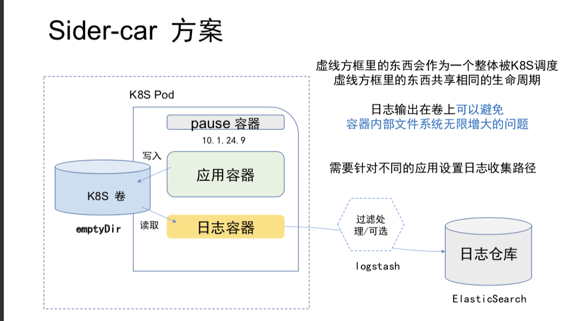

## K8S日志处理

* 日志的分类

    * k8s 的日志
    * k8s Cluster 里面部署应用日志

* 分析处理
    
    * 常见的处理方案ELK
    
* 不通的部署方案带来日志收集挑战

   * K8S 部署 systemd service （二进制日志）
      
      * 需要对 systemd serivce 日志单独收集
      * 增加而外管理成本
   
   * K8S 部署成Docker容器
      
      * 可以和负载收集方案
      * Docker 引擎支持 -live-restore 可以避免单点故障
      

日志收集方案：

日志写在标准输出和标准错误输出。

Docker 写在宿主机，日志目录。

让每个应用自己上传自己对日志。

 * 增加应用负载度/增加管理复杂度

* 附加专用日志上传容器 （side-car 模式）

  * 在POD里包含一个日志上传容器
  * 应用容器和日志容器通过共享券交换日志数据
  
* 使用Docker引擎的日志收集功能
 
  * 利用 Docker Log Driver 收集每个容器的标砖输出
  * 容器和标砖输出会被写在宿主机的日志目录
  * 日志上传容器从宿主机目录上传日志。
  * 日志收集和应用隔离
  

ES 容易崩溃， 所以前面必须加入Kafaka， 然后从kafuka

/var/log

docker 

 
              