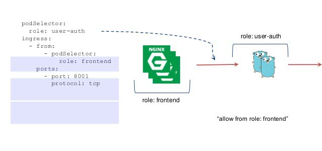

# Kubernetes 生态实践

Kubernetes是一个开源系统，它可以被用于自动部署，扩展和管理容器化应用程序，提供跨主机集群的自动部署、扩展以及运行应用程序容器的平台。这篇文章洋洋洒洒地介绍了， kubenetes入门的基础组件和使用方式， 如果你之前没有上手过Kubernetes， 建议直接跳到最后，在自己本地快速搭建k8s和helm开发环境。

## 概念和共识一览

### 1. 什么是 Kubernetes？

#### Kubernetes 所处的位置


#### 什么是容器

* 容器是一堆孤立的进程
* 容器有自己的PID，User， UTS，Mount Points, Network, 文件系统。
* 和VM很像, 但是： 1.基于进程的隔离 2. 没有操作系统，基于宿主机系统
* 优势: 启动时间更小，只需要启动一个进程，甚至不需要启动OS， 加快资源利用率和可调度性


#### 什么是Kubernetes

企业级容器编排技术

* 发布，管理，扩展集群应用
* 管理应用程序基础组件： 卷，网络，密钥，和其他操作系统所能提供的。
* 声明模型 应用程序状态保持和触发
* 名称：K8S，舵手

#### Kubernetes 的历史

Google的云端伸缩技术 （2014年6月宣布）

* Based on Google's internal "Borg" project
* 开源且开放治理


### 2. Kubernetes 工具程序集架构


从以上架构图可以看出：

* kube-apiserver 提供统一接口
* kube-scheduler  负责资源与POD匹配
* Kube-controller-manger 负责资源管理同步
* kube-proxy 负责K8S网络配置
* kubelet 管理Pod声明周期
* Kubectl 可以看作是基于kube-apiserver的客户端


### 3. Kubernetes 组件一览


* Pod 提供容器的抽象层
* Service 提供POD群和其他服务的交互途径。（避免动态销毁，动态IP问题）
* Lables 资源标识符
* Deplyment 提供软件的部署生命周期
* Volumes 数据持久化，生命周期可自由配置
* StatefulSet （宠物）为有状态应用提供支持。（有状态的Set）

### 3. Kubernetes 架构 - 部署流程

从一行命令说起:

```
kubectrl create -f deployment.yml
```

上手详情：[Kubernetes 101](https://kubernetes.io/docs/user-guide/walkthrough/)


1. kubectl 部署一个应用
2. API Server 收到一个请求后，存储到数据库（etcd）。
3. 各种Wathers/controllers 收到资源变化，并开始一定的动作。
4. ReplicaSet（副本集：具有一组稳定的容器组【pod】） wathers/controllers 收到一个新应用创建， 并创建一个新的 pod （容器组）
5. Scheduler （调度器）绑定一个pod到各个子节点的kubelet （修改数据库，并不真正触发转移动作）(*)
6. kubelet 收到pod并部署运行在容器中。（docker）
7. kubeproxy 管理各个pod的网络

### 4. Kubelet 架构 - kubelet


Kubelet 是部署在K8S子节点上的组件，从图中可以看出，Kubelet 就是创建和管理各种pod， 并与Master 交互。Kubelet 对 POD 处理方式，是现在云计算平台的关键技术之一。

Kubelet的运行逻辑和原理，可通过以下两个特性进行总结：

#### Kubelet 对资源的描述包括三个部分：

1. metadata 名字，命名空间， api version等。
2. spec 描述配置等，例如L：pod 由哪些container 组成的。
3. state 资源的状态， 资源当前的状态和行为。


#### Kubelet 几个共识：

1. Kublet 跑在各个子节点
2. Kublet 是子节点的主要 Agent
3. Kuelet 管理各自独立的容器。
4. Kubelet 创建和管理 pod （容器组），应用容器持久化存储。
5. Kubelet 根据各个服务和容器的配置图送到Master
6. Kubelet 监听端口， 命令行端口，http服务器接收pod的配置，一般情况下通过 API Server，获取 pod spec
7. Kubelet 可以使用cAdvisor（容器监控）来监控各子节点。
8. Kubelet 是通过 cgroups 和 linux 的 namespace 等技术来运行一个一个 pod.

### 5. Kubelet 架构  kube-proxy

Kube-proxy 是实现 Service 的关键组件，kube-proxy 会在每台节点上执行，然后监听 API Server 的 Service 与 Endpoint 资源对象的改变，然后来依据变化执行 iptables 来实现网络的转发。


kube-proxy 所在位置


### 5. Kubelet 架构  容器运行时


Kubenetes 支持所有继承了CNI洗衣的容器，和容器之间使用Containerd 进行通讯

## Kubernetes 网络


### 1. 网络基础

1. 容器网络：

* 每个容器分配独立的IP
* 使用网络策略实现访问控制

2. 负载均衡 （Service IP）
3. 外部访问

* 外部负载均衡
* Ingress的反向代理

###2. 网络架构


> pause: kubenets 基础组件，在pod启动之前，为所有的pod设置网络

### 3. Container Network Interface (CNI) (容器网络接口)


* Kubenetes 使用CNI来组建容器网络
* 当POD销毁是，kubernetes 将调用CNI来生成网络配置。
* CNI将生成虚拟网卡(NIC), 将其挂在在网络之上

配置示例：

```json
// 位置：/etc/cni/net.d/10-bridge.conf
{
  "name":"net",
  "type":"bridge",
  "bridge":"br-int",
  "isGateway":true,
  "ipMasq": false,
  "ipam":{
   		"type":"host-local",
    	"subnet":"10.96.0.64.26/26"
  }
}
```

### 3. 虚拟网络实现概览

基础：网络七层结构和应用


#### Calico 网络

Calico 网络组件

Calico

网络架构图

#### 

网络流程图


* 纯粹三层转发实现
* 通过BGP路由
* 使用IPTABLES 性能较好

[docker-container-lifecycle](https://docs.projectcalico.org/v1.6/reference/without-docker-networking/docker-container-lifecycle)

#### Flannel


原理（Network Overlay）：

* 数据从源容器中发出后，经由所在主机的docker0虚拟网卡转发到flannel0虚拟网卡，这是个P2P的虚拟网卡，flanneld服务监听在网卡的另外一端。（Flannel 通过Etcd服务维护了一张节点的路由表）
* 源主机的flanneld服务静原本的数据内容UDP封装后，根据自己的路由表投递给目的节点的flanneld服务，数据到达后被**解包**， 然后直接进入目的节点的flnnel0虚拟网卡，然后被转发到目的主机的docker0虚拟网卡。
* 最后就像本地容器通信以下的有docker0路由到达目标容器，这样整个数据包传递就完成了

特性：

支持跨子网的组网，不需要中间网络设备的硬件需求。

#### NSX-t


NSX-t 是 VMware 提取自vSphere的一种网络转发方式, NSX-t 采用**二层网络转发**的方式。

1. 每个节点有自己的网络交换机。（*Open vSwitch*）
2. NSX-t 的CNI Plugin也会分配IP地址给container， 并且把Container 的网络接入到 vSwitch上
3. NSX-t有控制器，可以通过打tag的形式做各种转发

#### Network Policy （网络隔离）



* Network Policy  属于 Resource， 可以通过API创建。
* 用于网络隔离， 定义不同容器之间的访问模式。
* 通过lable进行指定，可以允许哪些容器访问哪些容器的端口。（相当于：防火墙）
* 实现上使用：iptables 和 修改 open vswitch 规则
* 1.7 以前只支持ingress流入模式， 1.8 加入 egress 控制。控制流出模式。
#### 负载均衡 IP


1. 通过Service来实现, Service 拥有（CLUSTER-IP）
2. Kube-proxy 检测service改变，并更新iptables

问题：目前使用iptables的形式，可以解决大部分问题，使用NNAT进行进行负载， kube-proxy 运行在每个节点上， 就面临两个问题：

1.  iptables 使用chain的方式， 如果services 非常多， 会导致reload性能问题。
2.  无法保证ip地址头的一致性

####  IPVS 组件 （1.9 实验性） 

Proxy-mode: ipvs


* 解决iptables的性能问题
* 解决iptabels无法保留源ip地址头的问题
* 提供多种负载均衡算法, 最少链接，和加权路由的访问

使用示例


```
ipvsadm -ln
IP Virtual Server version 1.2.1 (size=4096)
Prot LocalAddress:Port Scheduler Flags
  -> RemoteAddress:Port           Forward Weight ActiveConn InActConn
TCP  10.111.21.136:80 rr persistent 10800
  -> 192.168.23.130:80            Masq    1      0          0
  -> 192.168.23.134:80            Masq    1      0          0
```

### 4. Kube-dns 介绍

kube-dns为Kubernetes集群提供命名服务，一般通过addon的方式部署，从v1.3版本开始，成为了一个内建的自启动服务。

组件:“Kubedns、DNSmasq、exechealthz”三个

DNSmasq: 一个小巧且方便地用于配置DNS和DHCP的工具

Exechealthz：健康检查

Kubedns： 接入skydns， 进行缓存，检查等。


kube-dns由三个容器构成：

- kube-dns：DNS服务的核心组件，主要由KubeDNS和SkyDNS组成
  - KubeDNS负责监听Service和Endpoint的变化情况，并将相关的信息更新到SkyDNS中
  - SkyDNS负责DNS解析，监听在10053端口(tcp/udp)，同时也监听在10055端口提供metrics
  - kube-dns还监听了8081端口，以供健康检查使用
- dnsmasq-nanny：负责启动dnsmasq，并在配置发生变化时重启dnsmasq
  - dnsmasq的upstream为SkyDNS，即集群内部的DNS解析由SkyDNS负责
- sidecar：负责健康检查和提供DNS metrics（监听在10054端口）


### 4. Kubenetes 外部访问

目前提供三种方式：

NodePort：将服务暴露在节点Ip地址的特定端口范围内（30000， 32767），

Loadbalancer： 虚拟IP映射

Ingress Controller： 七层反向代理，使用类似nginx的方式实现


附： service 定义方法


## kubernetes开发环境快速搭建

### install minikube

```
curl -LO https://storage.googleapis.com/kubernetes-release/release/`curl -s https://storage.googleapis.com/kubernetes-release/release/stable.txt`/bin/darwin/amd64/kubectl  && chmod +x /bin/darwin/amd64/kubectl
curl -Lo minikube https://storage.googleapis.com/minikube/releases/v0.24.1/minikube-darwin-amd64 && chmod +x minikube && sudo mv minikube /usr/local/bin/
```

```
minikube start
```

```
kubectl create -f https://raw.githubusercontent.com/kubernetes/dashboard/master/src/deploy/recommended/kubernetes-dashboard.yaml
```

```
kubectl proxy
```

```
http://127.0.0.1:8081/ui/
```

### install helm ui

```
brew install kubernetes-helm
```

```
helm init
helm repo update
```

Install with Helm: 

```
helm install stable/nginx-ingress
```

Minikube/Kubeadm: 

```
helm install stable/nginx-ingress --set controller.hostNetwork=true
```

Install monocular

```
helm repo add monocular https://kubernetes-helm.github.io/monocular
helm install monocular/monocular
```

```
kubectl get pods --watch
```

等待大概十分钟

```
kubectl get ingress
```

```
## get serviceip
curl $(minikube service good-mite-nginx-ingress-controller --url)
eval $(minikube docker-env)
```
