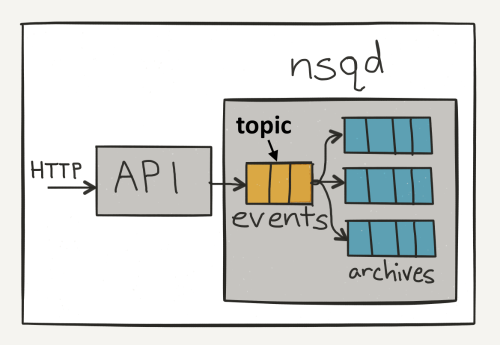
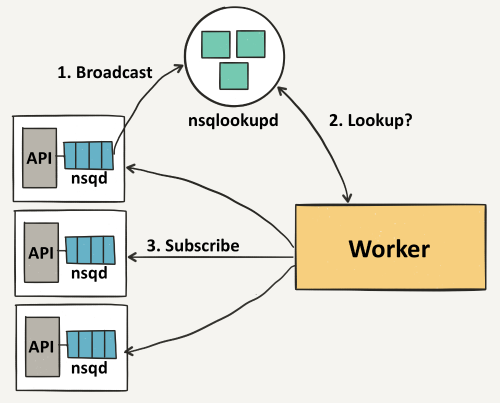
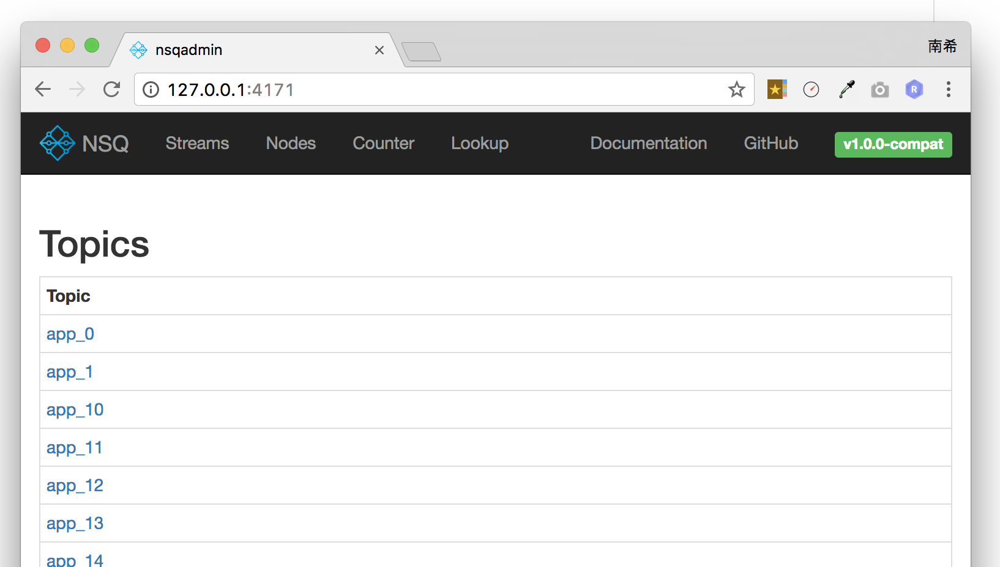

# NSQ 快速入门和性能测试

[NSQ](http://nsq.io)是实时的分布式消息处理平台，用于大规模系统中的实时消息服务，并且每天能够处理数亿级别的消息，其设计目标是为在分布式环境下运行的去中心化服务提供一个强大的基础架构。

## 快速入门

### NSQ 安装

docker-compose.yml

```yaml
version: '3'
services:
  nsqlookupd:
    image: nsqio/nsq
    command: /nsqlookupd
    ports:
      - "4160"
      - "4161"
  nsqd:
    image: nsqio/nsq
    command: /nsqd --lookupd-tcp-address=nsqlookupd:4160
    depends_on:
      - nsqlookupd
    ports:
      - "4150"
      - "4151"
  nsqadmin:
    image: nsqio/nsq
    command: /nsqadmin --lookupd-http-address=nsqlookupd:4161
    depends_on:
      - nsqlookupd  
    ports:
      - "4171"
```

```bash
docker-compose up -d
```
```bash
docker-compose ps
```

```
http://127.0.0.1:4171 (docker 外部映射端口可能不一致，具体查看docker-compose ps中对应的端口地址)
```


### NSQ主要组件

- [nsqd](http://nsq.io/components/nsqd.html)：一个负责接收、排队、转发消息到客户端的守护进程
- [nsqlookupd](http://nsq.io/components/nsqlookupd.html)：管理拓扑信息并提供最终一致性的发现服务的守护进程
- [nsqadmin](http://nsq.io/components/nsqadmin.html)：一套Web用户界面，可实时查看集群的统计数据和执行各种各样的管理任务
- [utilities](http://nsq.io/components/utilities.html)：常见基础功能、数据流处理工具，如nsq_stat、nsq_tail、nsq_to_file、nsq_to_http、nsq_to_nsq、to_nsq


### NSQ核心概念

- **Topic**：一个topic就是程序发布消息的一个逻辑键，当程序第一次发布消息时就会创建topic。

- **Channels** channel组与消费者相关，是消费者之间的负载均衡，channel在某种意义上来说是一个“队列”。每当一个发布者发送一条消息到一个topic，消息会被复制到所有消费者连接的channel上，消费者通过这个特殊的channel读取消息，实际上，在消费者第一次订阅时就会创建channel。

Channel会将消息进行排列，如果没有消费者读取消息，消息首先会在内存中排队，当量太大时就会被保存到磁盘中。

- **Message** 消息构成了我们数据流的中坚力量，消费者可以选择结束消息，表明它们正在被正常处理，或者重新将他们排队待到后面再进行处理。每个消息包含传递尝试的次数，当消息传递超过一定的阀值次数时，我们应该放弃这些消息，或者作为额外消息进行处理。


### NSQ是怎样运行的

NSQ在操作期间同样运行着两个程序：

**Nsqd** ——nsqd守护进程是NSQ的核心部分，它是一个单独的监听某个端口进来的消息的二进制程序。每个nsqd节点都独立运行，不共享任何状态。当一个节点启动时，它向一组nsqlookupd节点进行注册操作，并将保存在此节点上的topic和channel进行广播。

客户端可以发布消息到nsqd守护进程上，或者从nsqd守护进程上读取消息。通常，消息发布者会向一个单一的local nsqd发布消息，消费者从连接了的一组nsqd节点的topic上远程读取消息。如果你不关心动态添加节点功能，你可以直接运行standalone模式。

**Nsqlookupd** ——nsqlookupd服务器像consul或etcd那样工作，只是它被设计得没有协调和强一致性能力。每个nsqlookupd都作为nsqd节点注册信息的短暂数据存储区。消费者连接这些节点去检测需要从哪个nsqd节点上读取消息。

### NSQ消息的生命周期

NSQ提倡生产者与nsqd尽量在同一个实例环境中。生产者不需要负责发现其他的nsqd实例, 它们只管往自己的nsqd中投放消息。
  
NSQ具体的消息流程如下：

1. 生产者往本地的nsqd中发送消息，这个过程会开启一个连接，并发送一个带有topic和消息体的PUB的命令到nsqd中。我们假如是发送一个events的topic
2. events topic 会对消息进行copy,并多路发送到各个channel中, 我们假设有三个channel, 那么这个流程会如下图描述所示:
   
3. channel中的每条消息会被放进队列中, 直到消息被worker所消费掉, 如果队列占用的内存超出限制, 消息会被写进硬盘
4. nsqd节点会首先向nsqlookd节点广播它的位置信息, 一旦这些信息被nsqlookupd注册上, workers就会发现这些nsqd节点,包括这些节点的events topic，相关过程如下图
   
5. 每个worker向每个nsqd主机进行订阅操作，用于表明worker已经准备好接受消息了。这里我们不需要一个完整的连通图，但我们必须要保证每个单独的nsqd实例拥有足够的消费者去消费它们的消息，否则channel会被队列堆着。

### NSQ 为什么是可靠的

在生产环境中，我们几乎在我们所有的实例中运行nsqd守护程序，发布者之间协同定位。NSQ在实际生产中运行良好有几个原因：

**简单的协议** ——如果你的队列已经有了一个很好的客户端库，这个不是一个很大的问题，但如果你现在的客户端库存在bug或者过时了，一个简单的协议就能体现出优势了。

NSQ有一个快速的二进制协议，通过短短的几天工作量就可以很简单地实现这些协议，我们还自己创建了我们的纯JS驱动（当时只存在coffeescript驱动），这个纯JS驱动运行的很稳定可靠。

**运行简单** ——NSQ没有复杂的水印设置或JVM级别的配置，相反，你可以配置保存到内存中的消息的数量和消息最大值，如果队列被消息填满了，消息会被保存到磁盘上。

**分布式** ——因为NSQ没有在守护程序之间共享信息，所以它从一开始就是为了分布式操作而生。个别的机器可以随便宕机随便启动而不会影响到系统的其余部分，消息发布者可以在本地发布，即使面对网络分区。

### NSQ常见部署方式

启动nsqlookupd

> nsqlookupd

运行两个测试的nsqd实例

> mkdir -p /tmp/nsq/data1    #正式环境请不要放在临时目录
> nsqd --lookupd-tcp-address=localhost:4160 --data-path=/tmp/nsq/data1

运行前端监控

> nsqadmin --lookupd-http-address=localhost:4161

默认情况下, 可以在浏览器输入: host-name:4171 打开监控面板



由于nsq提供了一个unix-like的工具,所以我们可以在终端使用以下命令进行消息的发送测试:

```bash
curl -d 'hello world 1' 'http://127.0.0.1:4151/pub?topic=topic_test'
curl -d 'hello world 2' 'http://127.0.0.1:4151/pub?topic=topic_test'
```

发送后, 可以在监控面板观察页面数据的变化。

### 简单示例代码

生产者

```go
package main
import (
	"log"
	"github.com/nsqio/go-nsq"
)

func main() {
	config := nsq.NewConfig()
	w, _ := nsq.NewProducer("127.0.0.1:4150", config)
	err := w.Publish("topic_0", []byte("test")) //向topic_0发布消息test
	if err != nil {
		log.Panic("Could not connect")
	}
	w.Stop()
}
```

消费者

```go
package main

import (
	"log"
	"sync"
	"github.com/nsqio/go-nsq"
)

func main() {
	wg := &sync.WaitGroup{}
	wg.Add(1)
	config := nsq.NewConfig()
	q, _ := nsq.NewConsumer("topic_0", "ch", config)
	q.AddHandler(nsq.HandlerFunc(func(message *nsq.Message) error {
		log.Printf("Got a message: %v", string(message.Body))
		wg.Done()
		return nil
	}))
	err := q.ConnectToNSQD("127.0.0.1:4150")
	if err != nil {
		log.Panic("Could not connect")
	}
	wg.Wait()
}
```

### 特性和担保

#### 特性

- 支持无 SPOF 的分布式拓扑
- 水平扩展(没有中间件，无缝地添加更多的节点到集群)
- 低延迟消息传递 ([性能](http://wiki.jikexueyuan.com/project/nsq-guide/performance.html))
- 结合负载均衡和多播消息路由风格
- 擅长面向流媒体(高通量)和工作(低吞吐量)工作负载
- 主要是内存中(除了高水位线消息透明地保存在磁盘上)
- 运行时发现消费者找到生产者服务([nsqlookupd](https://github.com/bitly/nsq/tree/master/nsqlookupd/README.md))
- 传输层安全性 (TLS)
- 数据格式不可知
- 一些依赖项(容易部署)和健全的，有界，默认配置
- 任何语言都有简单 TCP 协议支持客户端库
- HTTP 接口统计、管理行为和生产者(**不需要客户端库发布**)
- 为实时检测集成了 [statsd](https://github.com/etsy/statsd/)
- 健壮的集群管理界面 ([nsqadmin](https://github.com/bitly/nsq/tree/master/nsqadmin/README.md))

#### 担保

对于任何分布式系统来说，都是通过智能权衡来实现目标。通过这些透明的可靠性指标，我们希望能使得 NSQ 在部署到产品上的行为是可达预期的。

* 消息不可持久化（默认）

虽然系统支持消息持久化存储在磁盘中（通过 `--mem-queue-size` ），不过默认情况下消息都在**内存**中.

如果将 `--mem-queue-size` 设置为 0，所有的消息将会存储到磁盘。我们不用担心消息会丢失，nsq 内部机制保证在程序关闭时将队列中的数据持久化到硬盘，重启后就会恢复。

NSQ 没有内置的复制机制，却有各种各样的方法管理这种权衡，比如部署拓扑结构和技术，在容错的时候从属并持久化内容到磁盘。

* 消息最少会被投递一次

如上所述，这个假设成立于 `nsqd` 节点没有错误。

因为各种原因，消息可以被投递多次（客户端超时，连接失效，重新排队，等等）。由客户端负责操作。

* 接收到的消息是无序的

不要依赖于投递给消费者的消息的顺序。

和投递消息机制类似，它是由重新队列(requeues)，内存和磁盘存储的混合导致的，实际上，节点间不会共享任何信息。

它是相对的简单完成**疏松队列**，（例如，对于某个消费者来说，消息是有次序的，但是不能给你作为一个整体跨集群），通过使用时间窗来接收消息，并在处理前排序（虽然为了维持这个变量，必须抛弃时间窗外的消息）。

* 消费者最终找出所有话题的生产者

这个服务([nsqlookupd](https://github.com/bitly/nsq/tree/master/nsqlookupd/README.md)) 被设计成最终一致性。`nsqlookupd` 节点不会维持状态，也不会回答查询。

网络分区并不会影响可用性，分区的双方仍然能回答查询。部署性拓扑可以显著的减轻这类问题。

### 不支持的使用场景

nsq大部分情况基本能满足我们作为消息队列的要求,而且性能与单点故障处理能力也比较出色， 但NSQ不能使用于以下场景。

> * 有顺序要求的消息
> * 不支持副本集的集群方式


## NSQ 性能测试

这篇文章主要对NSQ性能做测试。

### 测试环境

- 硬件环境
  - 处理器名称：Intel Core i5
  - 处理器速度： 3.1 GHz 
  - 处理器数目： 1
  - 核总数： 4
  - L2 缓存（每个核）： 256 KB
  - L3 缓存： 4 MB
  - 内存： 16 GB
- 软件环境
  - 操作系统：macOS 10.12.4 (16E195)
  - Go 语言版本： 1.8.1
  - NSQ版本：1.0.0-compat

### 生产写入性能测试

插入每条数据大小为200字节

| 运行时间 |   写入数据    |    写入速度    | 写入效率         | 耗时(us)/条 |
| :--: | :-------: | :--------: | ------------ | -------- |
| 10秒  | 3,278,200 | 55.594mb/s | 91,474.761/秒 | 3.431    |

> 测试脚本：https://github.com/nsqio/nsq/blob/master/bench/bench_writer/bench_writer.go

### 消费性能测试

每条数据大小为200字节

| 运行时间 |   读取数据    |    消费速度    | 读取效率          | 耗时(us)/条 |
| :--: | :-------: | :--------: | ------------- | -------- |
| 10秒  | 3,278,200 | 58.922mb/s | 308,920.325/秒 | 3.237    |

> 测试脚本：https://github.com/nsqio/nsq/blob/master/bench/bench_reader/bench_reader.go

### 并发单订阅性能测试

插入的数据大小为1字节

|  生产条数   |  生产耗时（毫秒）   |  消费耗时（毫秒）   |
| :-----: | :---------: | :---------: |
|   10    |  1.423013   |  1.197299   |
|  1000   |  47.938627  |  51.872540  |
| 10,000  | 460.019361  | 530.210616  |
| 100,000 | 5976.451920 | 6466.993025 |

> 结论：在当前测试环境，及时消费的情况下每秒可生产消费数据小于2万


### 并发多订阅测试

|  生产条数   |  生产耗时（毫秒）   | 消费者1耗时（毫秒） | 消费者2耗时（毫秒）  |
| :-----: | :---------: | :--------: | :---------: |
|   10    |  1.570398   |  1.228455  |  1.254492   |
|  1000   |  49.56317   |  60.15104  |  60.15104   |
| 10,000  | 466.007770  | 663.163937 | 663.961094  |
| 100,000 | 6516.490799 | 7105.19345 | 7107.097945 |

> 结论：多订阅会有一定时间上的损耗，但损耗不大。


```go
//并发测试脚本
package main

import (
	"github.com/nsqio/go-nsq"
	"log"
	"runtime"
	"time"
	"sync"
	"flag"
)

var (
	num        = flag.Int("num", 1000, "number of profuced")
	tcpAddress = flag.String("nsqd-tcp-address", "127.0.0.1:4150", "<addr>:<port> to connect to nsqd")
)

func main() {
	flag.Parse()
	runtime.GOMAXPROCS(runtime.NumCPU())
	test := Tester{}
	go func() {
		test.Produce(*num)
	}()

	time.Sleep(500 * time.Millisecond) //等待生产一定数量
	test.Consume(*num,"ch")
}

type Tester struct {

}
//Produce 测试生产数据， num 生产条数
func (this *Tester) Produce(num int) {
	config := nsq.NewConfig()
	w, _ := nsq.NewProducer(tcpAddress, config)
	start := time.Now()
	for i := 0; i < num; i++ {
		err := w.Publish("mc_topic_test", []byte("t"))
		if err != nil {
			log.Panicln(i, err)
		}
	}
	elapsed := time.Since(start)
	log.Printf("生产 %d 条数据耗时 %f", num, float64(elapsed.Nanoseconds()) / 1000000)
	w.Stop()
}
//Consume 测试消费 num 生产条数, channel 订阅的 channel
func (this *Tester) Consume(num int, channel  string) {
	wg := &sync.WaitGroup{}
	wg.Add(1)
	config := nsq.NewConfig()
	q, _ := nsq.NewConsumer("mc_topic_test", channel, config)
	cnt := num
	start := time.Now()
	q.AddHandler(nsq.HandlerFunc(func(message *nsq.Message) error {
		//log.Printf("Got a message: %v", string(message.Body))
		//wg.Done()
		cnt --
		if cnt == 0 {
			elapsed := time.Since(start)
			log.Printf("消费 %d 条数据耗时 %f", num, float64(elapsed.Nanoseconds()) / 1000000)
			wg.Done()
		}
		return nil
	}))
	err := q.ConnectToNSQD("127.0.0.1:4150")

	if err != nil {
		log.Panic("无法连接")
	}
	wg.Wait()
}
```