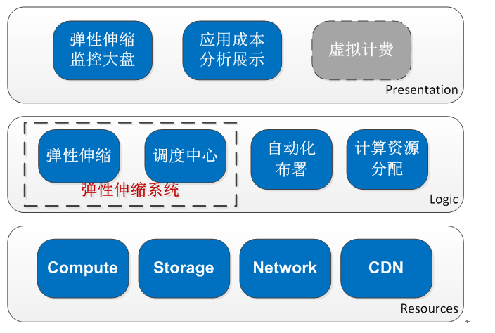
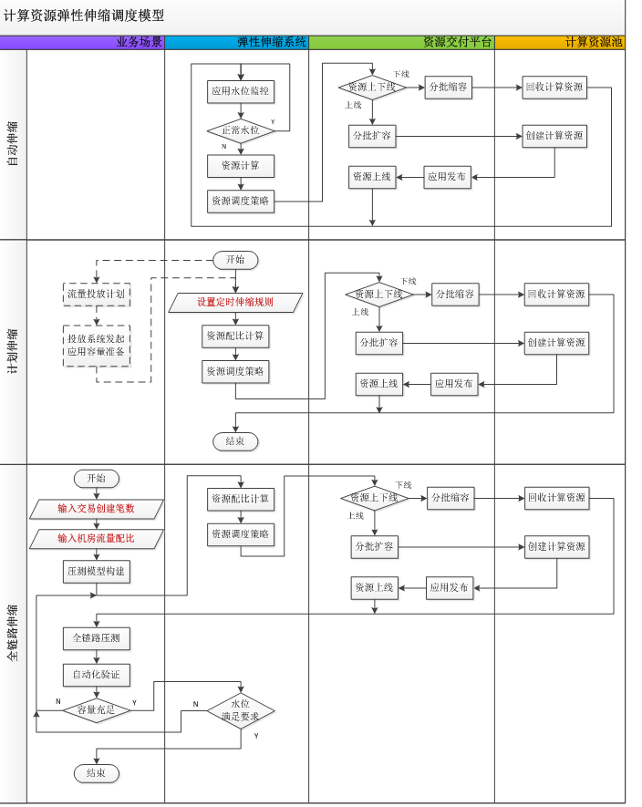
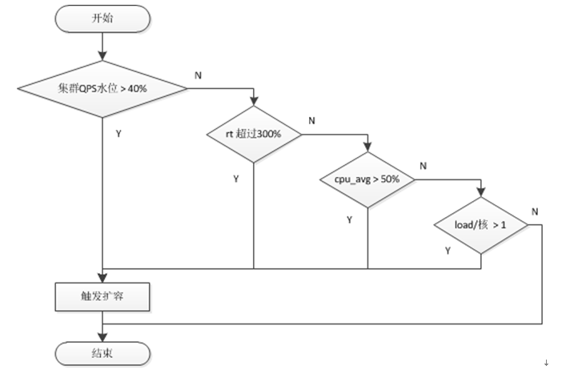
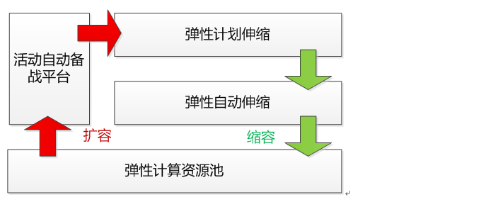

# 弹性伸缩部署

本文转载和补充目前弹性伸缩架构模型，旨在让初学同学们更佳清晰地认识弹性伸缩。

从业务生命周期而言，正处上升期的应用，访问量可能每月甚至每周成指数倍数地增长，当你在为业务快速发展、脱颖而出而畅想自high：哥写得一手牛逼代码即将要支撑起阿里未来五年的腾飞了！！啪，程序运行FGC，啪，调用方超时，啪，触发限流~也许这已经是最近第N次的报警，也许这是最近第N次调用方打电话过来投诉，也许这是最近第N次的扩容……还能不能好好玩耍，专心把代码撸到极致？！业务下降期的应用或许已经不再投入开发，你是否曾想过线上其实早已不需要那么多的机器资源了，如果折算成RMB，这每天到底是有多少张毛爷爷从口袋白白飞走？不能再任性了，快让应用弹起来，让有限的计算资源服务到优质的业务上吧！

## 一、弹性伸缩的原理

弹性伸缩（Auto Scaling）是根据不同的业务需求与策略，自动调整应用的弹性计算资源，最终达到优化资源组合的服务能力。通过 自动伸缩 和 计划伸缩 这两种工作模式，应用便能在无运维人员介入的情况下实现自动调整计算资源，当访问量上涨时增加计算能力，而当访问量下降时减小计算能力，既保障了系统的稳定性与高可用性，又节约了计算资源成本。

弹性伸缩在业界有两个方向，一个是垂直化的扩展（Scale up），一个水平化的扩展（Scale out）。从业务发展的角度来看应该是水平扩展的能力，这要求业务都是无状态的，通过负载均衡技术将访问请求分配到集群每一台机器上，不管是增加还是减少机器，业务的连续性都不应受到影响。

**垂直扩展**
>  在垂直扩展模型中，想要增加系统负荷就意味着要在系统现有的部件上下工夫，即通过提高系统部件的能力来实现。例如，假设你现在负责一批木材采伐的操作。
>  在这个例子中，我们假设有3辆卡车，每辆车一次可以运25根木材，计算花费1小时的情况下可以运送到指定地点等待处理的木材数量。通过这些数字我们可以算出我们系统最大的负荷量：
>  3辆卡车 * 25根木材 * 1小时=75根木材／小时
>  如果我们选择垂直扩展模型，那么我们将怎么做来使我们每小时可以处理150根木材？我们需要至少做以下两件事中的一件：
>  使每辆卡车的运输量增加一倍（50棵树每小时），或者使每辆卡车的运输时间减半（每辆卡车30分钟）。
>  3辆卡车 * 50棵树 * 1小时 = 150棵树／每小时
>  或者
>  3辆卡车 * 25棵树 * 30分钟 = 150棵树／每小时
>  我们没有增加系统的成员数，但是我们通过增加系统成员的生产效率来获得期望的负荷量。

**水平拓展**
> 在水平扩展模型中，我们不是通过增加单个系统成员的负荷而是简单的通过增加更多的系统成员来实现。也就是说，在以上运送木材的例子中，通过增加卡车的数量来运送木材。因此，当我们需要将负荷从75棵树每小时增加到150棵树每小时，那么只需要增加3辆卡车。
> 6辆卡车 * 25棵树 * 1小时 = 150棵树／每小时
> 假如我们已经选择了垂直扩展方式，那么我们想要每小时处理150棵被砍伐的树时需要怎么做呢？我们需要做到以下两方面之一：要么使每辆卡车的运输量翻倍(50棵木材一次)，要么使每辆开车的运输时间减半(30分钟)。
> 3辆卡车 * 50棵树 * 1小时 = 150棵树／每小时
> 或者
> 3辆卡车 * 50棵树 * 30分钟 = 150棵树／每小时
> 在这个例子中，系统每个成员的生产力依然没变，我们通过增加更多的卡车来提高系统的能力。

## 二、基于弹性伸缩的系统运维架构图

在此模型中，展示层为用户交互，接受和呈现信息，主要表现为：
弹性伸缩监控大盘：用于全局监控接入弹性平台应用的运行状态，以及配置应用的弹性伸缩规则；
应用成本分析展示：用于呈现应用使用的资源成本，包括计算资源、存储资源、网络与带宽资源、CDN资源等；
虚拟计费（待定）：通过虚拟货币形式来衡量应用运行的费用开销情况。

逻辑层为运维自动化的核心，主要表现为：
弹性伸缩系统：应用弹性伸缩、虚拟化计算资源调度的智能规则引擎；
自动化部署：新应用上线、集群扩容和缩容的自动化工具；
计算资源分配：虚拟化计算资源的创建与回收的虚拟化基础设施。

资源层为计算、存储、网络、CDN等基础设施资源。

## 三、计算资源弹性伸缩模型

## 四、弹性伸缩策略

**观察模式**

模拟弹性伸缩的过程，弹性伸缩系统将会通过旺旺和邮件通知应用负责人以及运维人员什么时候要扩容或缩容、涉及的机器数，但是不会真正触发扩容和缩容的这个动作，此外，还可以在人工确认的情况下，手动触发扩容和缩容。简而言之，观察模式可以理解为应用接入弹性伸缩系统的一重保障。

**自动伸缩**

根据日常负载情况，计算应用所需的计算资源，以此达到降低成本、提升稳定性的目的。

1. 伸缩范围
   最大实例数: 接入弹性前，集群的机器总数
   （说明：当前应用有充足机器容量）
   最小实例数: max(前七天qps峰值) / 单机QPS极限值 * 60%
   （说明：最小实例数，前期阶段不会直接探底，会留有一部分余量）

2. 伸缩规则
   扩容条件: 
   （1）集群水位超过40%
   （2）每个CPU的等待队列长度大于0.5   或   cpu_avg超过50%   或   rt升高百分比超过300%
   持续时间超过2分钟
   
   缩容条件: 
   （1）集群水位低于13%
   （2）每个CPU的等待队列长度小于0.2   与   cpu_avg小于15%
   持续时间超过5分钟

3. 期望水位: 35% 

备注：
集群水位 = 集群QPS / （单机QPS极限值 * 机器数）
单机QPS极限能力: csp单机压测值

**计划伸缩**

计划伸缩也称作定时伸缩，应用场景主要是根据计划提前做好各个系统的容量准备，以便承受可预见的瞬间访问高峰。举个例子，运营同学A准备今天要一次广告投放引流，一大波流量正在逼近！！假如A将预计引流PV总量事前告知弹性伸缩系统，提前将应用容量准备好，多少的流量过来都妥妥的了，真是深藏功与名~

**全链路伸缩**

复用自动化备战平台功能，根据预计交易创建笔数以及机房流量分配进行系统容量准备

**机器下线规则**

首先计算出应用缩容的机器数量；
通过CMDB获取到下线机器列表，同时调用发布系统接口将beta机器加入到下线排除机器列表，如果有特殊需要排除的机器，需要在弹性伸缩系统上手动添加；
分批下线机器，以尽可能减小对业务访问造成抖动。

补充：
弹性伸缩必备条件：

1. 业务之间无状态。（统一token验证，统一用户中心）
2. 数据库弹性，业务弹性，nginx，数据库，rpcX
3. QoS（Quality of Service，服务质量）(·**丢失**数据包,延迟,传输顺序出错,出错)

弹性调度算法
1、bully算法

2、环算法
