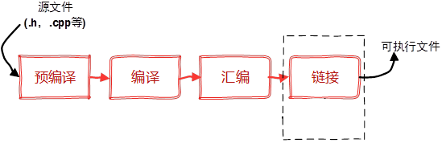
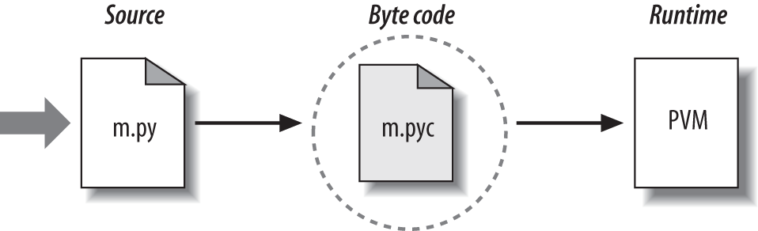
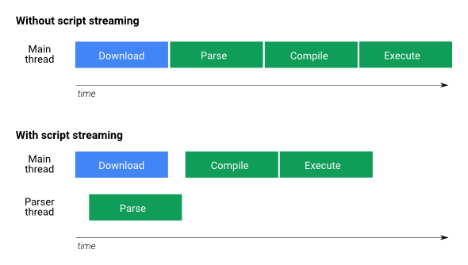
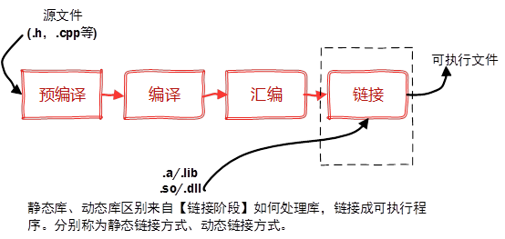
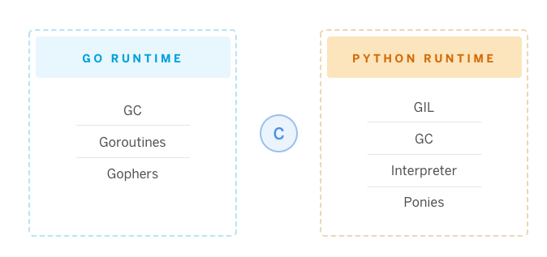
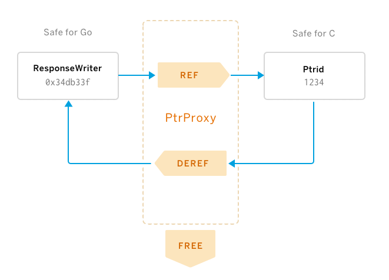
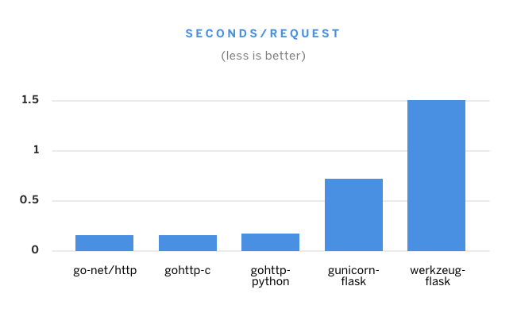

# 跨语言对话 (python & go)

因为go可以调用c，python 可以调用c，所以 go 也可以调用 python

## 编译过程（编译语言）



## python 等解释性语言执行过程(php,nodejs, chrome javascript)




### chrome js



### 动态库和静态库(系统级支持)



### 运行过程


#  Python And GO

### Do You Go

* Simple syntax that is easy to learn
* Compiles superfast
* Statically typed
* Statically linked binaries
* Cross-compiles to ~every platform
* Easy concurrency
* Great standard library (!important)

### Python go
```python
import os
os.system("go run main.go")
```

(Just kiding)

### Fun Facts
* Python speaks with C
* Go speaks with C
* Therefore, Python speaks with Go?

### Challenges
1. Runtime barriers
   - Garbage Collectors (GC) （垃圾回收）
   - Global Interpreter Lock (GIL) (全局编译锁)
   - Just In Time compiling (JIT) （即时编译器）
   - Resource Pools (Threads)（线程，进程，内存..）
2. Syntax and feature barriers
   - Go: Interface, Goroutines, etc.
   - Python: Classes, Generators, etc.
   - Oodles of other language-specific constructs

### Runtime Boundaries




### 看看我们需要做些什么？


## [Running a Webserver in Go]

```go
package main

import (
    "fmt"
    "net/http"
)

func index(w http.ResponseWriter, req *http.Request) {
    fmt.Fprintf(w, "Hello, world.\n")
}

func main() {
    http.HandleFunc("/", index)
    http.ListenAndServe("127.0.0.1:5000", nil)
}

```

## [Running a Webserver in Python]

```pythoh
from flask import Flask
app = Flask(__name__)

@app.route('/')
def index():
    return 'Hello, world!\n'

if __name__ == '__main__':
    app.run(host='127.0.0.1', port=5000)

```

## [Running a Go Webserver in Python??]

```
from gohttp import route, run

@route('/')
def index(w, req):
    w.write("Hello, world.\n")

if __name__ == '__main__':
    run(host='127.0.0.1', port=5000)

```
Compare
```pythoh
from flask import Flask
app = Flask(__name__)

@app.route('/')
def index():
    return 'Hello, world!\n'

if __name__ == '__main__':
    app.run(host='127.0.0.1', port=5000)
```

## Comparing handlers

**Go (net/http)**
```go
func index(w http.ResponseWriter, req *http.Request) {
    fmt.Fprintf(w, "Hello, world.\n")
}
```

Go in Python (gohttplib)
```python
def index(w, req):
    w.write("Hello, world.\n")
```

python
```python
def index():
	return'Helo,world!\n'
```


## [Yo--whaa???]

* C／C++ 至今没有一个现代化的web server
* 大部分解释型语言web server 很慢。（主要原因是运行时机制）


https://github.com/shazow/gohttplib


## Here's how it works...

1. Go: Export Go functions to a C shared library
2. C:
3. Python: Call C and wrap it in a Python-shaped bow
4. Make it actually work  ̄\_(ツ)_/ ̄

## let's hack it


## [World of Go](https://blog.heroku.com/see_python_see_python_go_go_python_go#world-of-go)

Let's explore how to call C from Go and Go from C.

### [Calling C from Go]

```go
package main

/*
int the_answer() {
    return 42;
}
*/
import "C"
import "fmt"

func main() {
    r := C.the_answer()
    fmt.Println(r)
}

```

```bash
$ go build-o answer
$./answer
42
```


### [Calling Go from C]

```
package main

import "C"

//export TheAnswer
func TheAnswer() C.int {
    return C.int(42)
}
func main() {}
```

```bash
go build -buildmode=c-shared -o libanswer.so
```

```c
#include <stdio.h>
#include "libanswer.h"

int main() {
    int r = TheAnswer();
    printf("%d\n", r);
    return 0;
}
```
```bash
$ gcc -o answer main.c -L. -lanswer
$ ./answer
42
```


## [World of Python](https://blog.heroku.com/see_python_see_python_go_go_python_go#world-of-python)

Now onto the Python side of this business. Same idea, so let's look at how to call Python from C and C from Python.

### [Calling C from Python](https://blog.heroku.com/see_python_see_python_go_go_python_go#calling-c-from-python)

* [CPython Extension Interface](https://docs.python.org/3/extending/extending.html): no dependencies, butlots of boilerplate

* [CFFI](https://cffi.readthedocs.io/): a little more magic but does more work for usand more portable

## Calling C from Python
源码
```python
# answer_build.py:
from cffi import FFI
ffi = FFI()

ffi.cdef("int the_answer();")

ffi.set_source("_answer",
"""
    int the_answer() {
        return 42;
    }
""")

if __name__ == "__main__":
    ffi.compile()

```
编译
```bash
$ python answer_build.py
$ ls
_answer.c       _answer.o       _answer.so      answer_build.py
```
源码
```python
# answer.py:
from _answer import lib

r = lib.the_answer()
print(r)

```
运行
```bash
$ python answer.py
42
```


## Calling Python from C
Simple function pointer that can be used in C:

PYTHON

```python
@fi.callback("int(int,int)")
def ad(x,y):
	return x+y
```
C
```c
static int(*ad)(int x,int b);
```

### Challenges
1. Runtime barriers
   - Garbage Collectors (GC) （垃圾回收）
   - Global Interpreter Lock (GIL) (全局编译锁)
   - Just In Time compiling (JIT) （即时编译器）
   - Resource Pools (Threads)（线程，进程，内存..）
2. Syntax and feature barriers
   - Go: Interface, Goroutines, etc.
   - Python: Classes, Generators, etc.
   - Oodles of other language-specific constructs

### Overcoming Challenges


## Challenge 1: 基本架构

```go
http.HandleFunc(pattern,func(w http.ResponseWriter,req *http.Request){
	...
})
```
我们不能直接在python中调用golang 的 *http.Request, 因此需要建立一个C类。

```c
typedef struct Request_
{
    const char *Method;
    const char *Host;
    const char *URL;
    ...
} Request;
```

然后在Go语言中：

```go
//export HandleFunc
func HandleFunc(cpattern *C.char, cfn *C.FuncPtr) {
    pattern := C.GoString(cpattern)
    http.HandleFunc(pattern, func(w http.ResponseWriter, req *http.Request) {
        // 转换请求对象到C.
        creq := C.Request{
            Method: C.CString(req.Method),
            Host:   C.CString(req.Host),
            URL:    C.CString(req.URL.String()),
        }
        ...
    })
}
```
### Overcoming Challenges

1. 基本架构
2. 翻译层

## Challenge 2: 翻译层
```go
http.HandleFunc(pattern,func(w http.ResponseWriter,req *http.Request){
	...
})
```
我们需要的代码
```python
ResponseWriter.Write([]byte) (int, error)
ResponseWriter.WriteHeader(int)
```
实现逻辑
```go
//导出 ResponseWriter_Write
func ResponseWriter_Write(wPtr C.uint, cbuf *C.char, length C.int) C.int {
    buf := C.GoBytes(unsafe.Pointer(cbuf), length)
    ...
    n, err := (*(*http.ResponseWriter)(w)).Write(buf)
    ..
    return C.int(n)
}
//导出 ResponseWriter_WriteHeader
func ResponseWriter_WriteHeader(wPtr C.uint, header C.int) {
    ...
    (*(*http.ResponseWriter)(w)).WriteHeader(int(header))
}
```
## Challenge 2: 翻译层 (Cont.)
导出以下两个Go方法
```
func ResponseWriter_Write(wPtr C.uint, cbuf *C.char, length C.int)
func ResponseWriter_WriteHeader(wPtr C.uint, header C.int)
```
转换为python中应该是：
```python
lib = ffi.dlopen(os.path.join(os.path.dirname(__file__), "libgohttp.so"))
class ResponseWriter:
    def __init__(self, w):
        self._w = w
        //第一个方法： ResponseWriter_Write
    def write(self, body):
        n = lib.ResponseWriter_Write(self._w, body, len(body))
        if n != len(body):
            raise IOError("Failed to write to ResponseWriter.")
       //第一个方法：ResponseWriter_WriteHeader
    def set_status(self, code):
        lib.ResponseWriter_WriteHeader(self._w, code)
```

## Challenge 2: 翻译层(Cont.)

原始Go代码
```go
type http.ResponseWriter interface { WriteHeader(int) }
```
导出的方法
```go
func ResponseWriter_WriteHeader(wPtr C.uint, header C.int)
```
导出的c 头文件
```c
void ResponseWriter_WriteHeader(unsigned int p0, int p1);
```
从Python中访问C
```python
 ResponseWriter_WriteHeader(w, header)
```

## Challenge 3: 对象传递
* Wait, what's a Go interface?
* To use it, we need to pass a pointer through
  Go ⇢ C ⇢ Python ⇢ C ⇢ Go
* Solution: 指针代理

## Pointer Proxy



```go
type ptrProxy struct {
    sync.Mutex
    count  uint
    lookup map[uint]unsafe.Pointer
}
// Ref 注册给定的指针并返回可以用于稍后检索它的对应id。
func (p *ptrProxy) Ref(ptr unsafe.Pointer) C.uint { ... }

// Deref 接受一个id并返回相应的指针（如果存在）。
func (p *ptrProxy) Deref(id C.uint) (unsafe.Pointer, bool) { ... }

// Free 清空给定指针
func (p *ptrProxy) Free(id C.uint) { ... }
```


## Quick flashback: Translation layer
One pointer proxy to rule them all.
```go
var cpointers = PtrProxy()
```
In the callback, reference to bind them.
```go
http.HandleFunc(pattern, func(w http.ResponseWriter, req *http.Request) { // Wrap relevant request fields in a C-friendly datastructure.
creq := C.Request{ ... }
    wPtr := cpointers.Ref(unsafe.Pointer(&w))
    ...
    cpointers.Free(wPtr)
})
```
With pointer proxy, dereference to find them.
```go
func ResponseWriter_WriteHeader(wPtr C.uint, header C.int) {
    w, _ := cpointers.Deref(wPtr)
    (*(*http.ResponseWriter)(w)).WriteHeader(int(header))
}
```

## 完整代码(Go http lib)

https://github.com/shazow/gohttplib/


## [lolbenchmarks](https://blog.heroku.com/see_python_see_python_go_go_python_go#lolbenchmarks)

It's fun to take a look at the performance characteristics of this kind of approach. Yes, yes, of course, this isn't *Production Ready* or anything, but for the sake of some laughs:



These are all basic "Hello, world\n" handlers. The first one is straight-up Go, then it's Go-to-C, then it's Go-to-C-to-Python (gohttp-python). It does pretty well.

Keep in mind that this is with 10 concurrent requests, so werkzeug-flask probably chokes more on the concurrency than the response time being slow.

| Name           | Total  | Req/Sec | Time/Req |
| -------------- | ------ | ------- | -------- |
| go-net/http    | 1.115  | 8969.89 | 0.111    |
| gohttp-c       | 1.181  | 8470.97 | 0.118    |
| gohttp-python  | 1.285  | 7779.87 | 0.129    |
| gunicorn-flask | 7.826  | 1277.73 | 0.783    |
| werkzeug-flask | 15.029 | 665.37  | 1.503    |

## [What's left?](https://blog.heroku.com/see_python_see_python_go_go_python_go#what-39-s-left)

We've discussed 80% of what's involved, but the remaining 80% is still available as an exercise for the reader (or maybe a future blog post):

- The `gohttp` Python dependency comes pre-published to PyPI for your convenience, but you'll need build and distribute the dependency yourself if you want to tweak it further.
- Play whack-a-mole with memory leaks. The current prototype is not safe or battle-tested by any means. Any time a C variable gets declared, we'll need to free it.
- Implement the rest of the interfaces that we need. Right now there are only a couple of functions available but there is much more to build a full server. [Pull requests welcome](https://github.com/shazow/gohttplib)!


总结

* If our languages can speak with C, they can speak with each other.
* Be careful going in and out of runtimes.
* Be super-careful with sharing memory.
* We'll need a translation layer to use non-trivial language constructs.


## Other Considerations
* Memory leaks
* Race conditions
* Context switching overhead
* security issues because C is hard
* Architecture campanelle