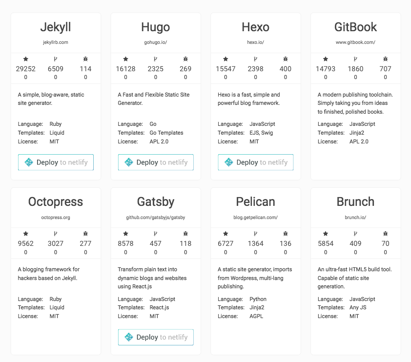
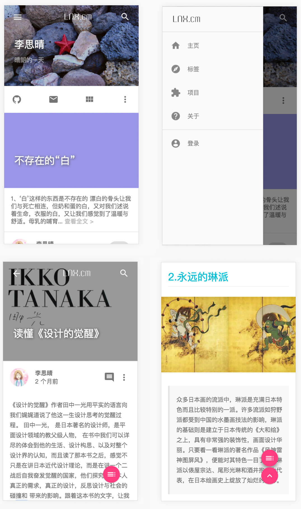
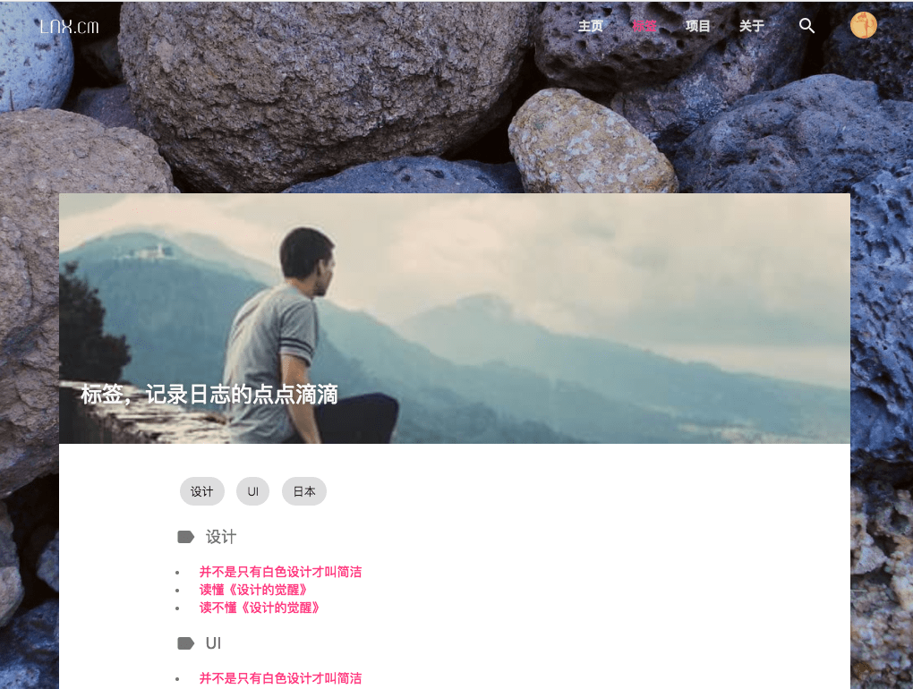

# MdRest 关于Markdown博客，你所期望的都在这里

从Markdown建站，几乎成了整个技术圈博客标配，但是Markdown的技术存在很多限制，搜索下目前Markdown博客引擎你会发现，所有的博客引擎定制化不是很高，并且目前很多很流行的博客引擎都不太完善。目前流行的Markdown引擎如下，这些东西缺点显而易见。




对于一个技术流而言，这些博客可拓展性太差，对于一个非技术流而言，操作太复杂。一直想写一个restful风格的Markdown引擎，一个偶然的机会，工作中需要改版开发者中心的文档系统，于是一个`restful`风格的Markdown引擎就应运而生了，耗时：5天。这比我想象的时间少了很多，于是就将其作为一个库进行开源。

Github地址：https://github.com/ti/mdrest

最终展示效果：

1. 博客： http://nanxi.li
2. 文档中心：http://accounts.cug.edu.cn/apps/docs.html

先上几张图，说明Markown最终效果，当然，如果你是在我的博客中阅读这篇文章的话，博客本身就是最好的效果展示。






> MdRest 本身不做博客，它只是数据生成器。你无需对现有的md文件做任何更改，就可以轻松地将她们转换为可索引，结构化，免服务器，低成本的json数据。md文档的数据化，给前端展示带来无限可能，它可以是文档中心，可能是普通博文，也可能是录音，视频，相册，将数据与展示解绑才能更多可能。


## 特性

### 1. 自由的目录结构和文章内容

自由的目录结构，你的博客目录可以是这个样子，所有的目录安排，图片资源摆放，完全可以按照你自己的喜好和规则，无需按照特定的约束进行。markdown rest引擎会将所有图片资源转换为以根目录为主目录绝对路径。也意味着，如果你的文章在git中浏览是正常的，那在博客中也会是正常的，无需对文章做转换。

目录结构

```
sample_docs                           
├── Simple Article.md                 
├── YAML Article.md                   
├── _DraftArticle.md                  
├── first dir                         
│   ├── Hello word.md                 
│   └── img                           
│       └── logo.png                  
└── second\ dir                       
    └── Hello\ word.md                
```

文档结构：

```
# Hello world
这篇文章会自动识别文章标题，自动截取文章简介，自动转换图片相对流经。


查看关联的其他文章,
[other reference markdown](../folder2/reference.md)
```

### 2. 智能的文档属性

如果你用过其他的博客引擎，可能会要求你的博客是下面这个样子的。

```
---
title: Hello world
author: leenanxi
catalog: blog
tags: [tag1, tag2]
date: 2016-12-29
draft: true
---
# Hello world
This is content
```

Mdrest对Markdown的格式没有要求，你的文章可以是下面这个样子。文章的标题，创建日期，catalog 都可以自动生成。标题生成的的优先级是：yaml -> 第一个# -> 文件名。 草稿文章标题可以是 _filename.md

```
# Hello world
This is content
```
### 3. 自由的JSON输出

MdRest支持任何格式的Yaml标签，它会将您的Ymal标签转换为JSON，例如您的文章可以是下面这个样子的。大多数使用markdown博客引擎主题的时候会使用html和js修改主题的很多功能，mdrest给开发者最大的修改自由，允许完全自由的输出格式。
```
---
video: /videos/hello_word.mp4
medias: [video1.mp4, video2.mp4,pic1.jpg]
other1: 
name: "name"
x1: [3, 4]
---
# Hello world
This is content
```
### 4. 拓展Markdown渲染 （模仿简书）
 我们的博客中图片难免需要插入图片标注，之前很多人的做法是给图片下面添加一个段落或块引用来进行，其实Markdown原生支持 `` 这样的形式，mdrest会自动将title作为题注，进行html渲染，当然，您可以在markdown中使用html进行更复杂的操作。

```
# Hello world

```


### 5. 极简的前端组件。

* 不使用jQuery
* 不使用任何JS框架
* 纯粹的html5开发

> 目前的博客前端完全模仿angularjs的路由和API风格，但是整体架构却使用原生JS自行编写，因此体积很小，前端所有的业务逻辑JS和框架JS加起来只有：83.1 KB， 作为对比，流行的框架体积如下，可以看到应用的全部代码都比任何一个js库小。

| Library/Framework | size (min)   |
| ----------------- | ------------ |
| jQuery 3.2        | 86kb         |
| React             | 147kb/**     |
| Angular 1         | 159kb/235kb  |
| Polymer           | 222kb/302kb  |
| Aurelia           | 287kb/352kb  |
| Ember             | 433kb        |
| Angular 2         | 623kb/1023kb |

>  大部分小应用场景下，我们不需要任何框架来开发前端组件，体积，效率，自由度各方面都有影响。了解基础的js知识 + 各框架基本原理，可以给我们的应用带来意想不到的时间和空间上的收获。

## 写在最后

推荐使用typora作为markdown的主要编辑工具，可以给你带来更简单的输入体验。